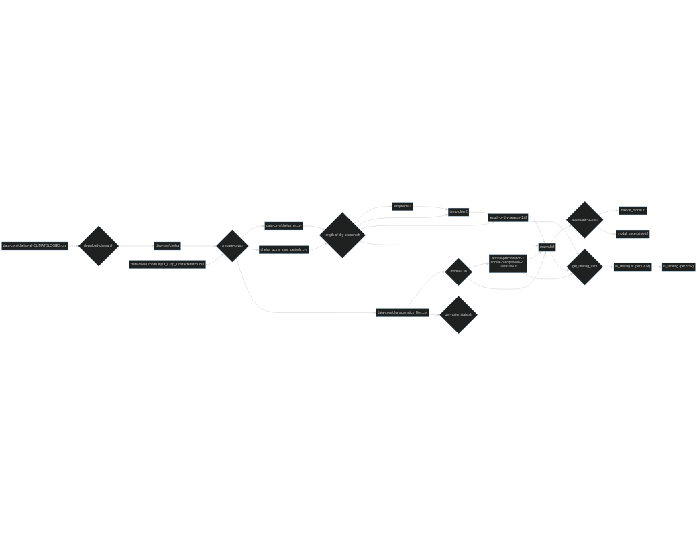

## Abstract

This repository is holds the code used to process the data in the project "**Impact of climate change on black pepper (P. nigrum) cultivation - A global suitability analysis**". The internal report of this project will be submitted end of 2023, a publication is planned to follow soon. Here is a short description of the project in our universities research database <https://www.zhaw.ch/en/research/research-database/project-detailview/projektid/6103/>.

This repository only holds code, but not physical raster data. How the data can be obtained is described below.

The code is written in `R` and `bash` (`gdal`) and was executed the [ZHAW LSFM High Performance Cluster](https://www.hpc-ch.org/zhaw-zurich-university-of-applied-sciences/). Technical details of the cluster are visible from the `lscpu` output (see [HPC](#hpc)).


## Project Pipeline

The project pipeline consists of individual scripts that typically produce outputs which are used by other scripts. The following diagram shows the pipeline and the dependencies between the scripts. The scripts are numbered in the order they should be executed. 

[](https://raw.githubusercontent.com/zhaw-consus/Pfefferanbau-Modelling/main/images/workflow.svg)

**Click on the image for full size view**


### Obtaining the data

The following inputs are needed to run the code in this repository. The data is not included in this repository, but can be obtained openly as described below. The data should be stored in a folder named `data-raw`.

| Name              | Desciption           | Download Date      | URL                       | Subfolder    |
|-------------------|----------------------|--------------------|---------------------------|--------------|
| Chelsa            | Climate data         | 2023-05-11         | https://envicloud.wsl.ch  | `chelsa`     |
| Elevation         | Digital Elevation    | 2023-06-19         | https://www.worldclim.org | `elevation`  |
| phh20             | Soil data            | 2023-03-19         | https://soilgrids.org     | `phh20`      |


The data can be downloaded using a bash script (`one-time-tasks/download-chelsa.sh`) and the list of urls (`data-csvs/chelsa-all-CLIMATOLOGIES.csv`). In case the data is outdated or the URLs are not valid anymore, the URL must be optained manually from the respective websites (see table above). For the chelsa data, the following datasets are necessary:
  - `climatologies/(2011-2040|2041-2070|2071-2100)/*/*/(bio|pr|tas)`
  - `climatologies/1981-2010/(pr|tas|bio|hurs|cmi)`

**Quality Checks**: The script `one-time-tasks/quality_check_before_download.R` checks if the list of URLs is complete and does not contain unnecessary files.


3. **Download data**: Download the datasets specified in the URL. The scripts `one-time-tasks/download-chelsa.sh` facilitate this (linux only).
4. **Quality Checks**: Run `quality_check.r` to check if the list of downloaded files is complete
5. **Download phh20 and DEM**: Download the dataset *phh20* from soildgrids.org and the digital elevation model from worldclim. The scripts to download these files can be found here: `one-time-tasks/get_phh20.sh` 
6. Run Scripts:
   1. **Prepare CSV**: The script `prepare-csvs.r` prepares all the csvs over which the next bash script (gdal) can iterate. TODO: Add some more quality checks
   2. The script `model-it.sh` executes the modelling of the szerarios for future
and historic data.
   3. The script `length-of-dry-season.sh` calculates the variable "*Lenght of dry season*" from the percipitation dataset.
   4. The script `aggregate_gcms.R` calculate the modal value over all GCMs in a ssp
   5. The script `get_diff_future-historic.r` calculates the difference between the modal value (see prev. step) and the historic value. 
   6. The script `get_limiting_var.r` determins the limiting variable per individual modal. the output is a multilayered tif with 0/1 values (limits / does not limit)


## HPC Notes


### Modules & Conda

```
# RHEL 8
module load gcc/9.4.0-pe5.34 miniconda3/4.12.0 lsfm-init-miniconda/1.0.0

# to run the r-code in this repo
conda activate consus

# to run the bash files (gdal_* etc) in this repo
conda activate geopython
```

(i couldn't create one single environment for some reason. gdal_calc.py is missing from the consus environment, all r stuff is missing from the geopython env)


### Copy the data from the HPC to my local machine

Go to your *local* project folder (e.g. `/home/nils/ownCloud/Projekte/2023_Pfefferanbau/`) and run the following command:

```
scp -r rata@login.hpc.zhaw.ch:/cfs/earth/scratch/rata/consus/data-modelled .
```


### Sync with group folder

To give grea access to the data, I need to manually sync the respective folders with the group folder on the HPC. To do this, run the following commands from the root directory:

``` 
# sync input data
rsync -a --progress /cfs/earth/scratch/rata/consus/data-raw /cfs/earth/scratch/iunr/shared/iunr-consus

# sync modelled data
rsync -a --progress /cfs/earth/scratch/rata/consus/data-modelled /cfs/earth/scratch/iunr/shared/iunr-consus
```

`-n` or `--dry-run` is to test

Since there is no trailing backslash to the source folder, the mentioned folder with be added as a subfolder to the destination folder. 


### gdal_calc.py

To run gdal_calc.py, you need to find the python file first.

```
find /cfs/earth/scratch/rata/.conda/envs/consus/ -iname "gdal_calc*"

/cfs/earth/scratch/rata/.conda/envs/consus/share/bash-completion/completions/gdal_calc.py
```


### Specs


Output from `lscpu`:


```
$ lscpu
Architecture:          x86_64
CPU op-mode(s):        32-bit, 64-bit
Byte Order:            Little Endian
CPU(s):                32
On-line CPU(s) list:   0-31
Thread(s) per core:    1
Core(s) per socket:    16
Socket(s):             2
NUMA node(s):          2
Vendor ID:             GenuineIntel
CPU family:            6
Model:                 85
Model name:            Intel(R) Xeon(R) Gold 6142 CPU @ 2.60GHz
Stepping:              4
CPU MHz:               2600.000
BogoMIPS:              5200.00
Virtualization:        VT-x
L1d cache:             32K
L1i cache:             32K
L2 cache:              1024K
L3 cache:              22528K
NUMA node0 CPU(s):     0-15
NUMA node1 CPU(s):     16-31
Flags:                 fpu vme de pse tsc msr pae mce cx8 apic sep mtrr pge mca cmov pat pse36 clflush dts acpi mmx fxsr sse sse2 ss ht tm pbe syscall nx pdpe1gb rdtscp lm constant_tsc art arch_perfmon pebs bts rep_good nopl xtopology nonstop_tsc aperfmperf eagerfpu pni pclmulqdq dtes64 monitor ds_cpl vmx smx est tm2 ssse3 sdbg fma cx16 xtpr pdcm pcid dca sse4_1 sse4_2 x2apic movbe popcnt tsc_deadline_timer aes xsave avx f16c rdrand lahf_lm abm 3dnowprefetch epb cat_l3 cdp_l3 invpcid_single intel_ppin intel_pt ssbd mba ibrs ibpb stibp tpr_shadow vnmi flexpriority ept vpid fsgsbase tsc_adjust bmi1 hle avx2 smep bmi2 erms invpcid rtm cqm mpx rdt_a avx512f avx512dq rdseed adx smap clflushopt clwb avx512cd avx512bw avx512vl xsaveopt xsavec xgetbv1 cqm_llc cqm_occup_llc cqm_mbm_total cqm_mbm_local dtherm ida arat pln pts pku ospke md_clear spec_ctrl intel_stibp flush_l1d arch_capabilities
```
